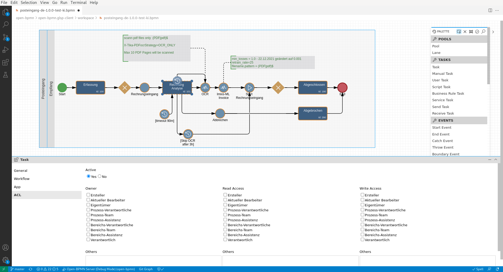

# Imixs Open BPMN

This is the Imixs Open-BPMN - Extension for Imixs-Workflow.

Find details on the [Open-BPMN project page](https://www.open-bpmn.org/install-imixs.html).

# Docker

We provide a custom Docker image that it overwriting the GLSP Server jar file

## Build

To build the docker image run:

    $ docker build . -t imixs/imixs-open-bpmn

# Push to Docker-Hub

To push the image manually to a docker repo:

    $ docker build . -t imixs/imixs-open-bpmn:latest
    $ docker push imixs/imixs-open-bpmn:latest

# Release Process

The release process of Imixs-Open-BPMN is based on the standard [Imixs-Workflow release process](https://github.com/imixs/imixs-workflow/wiki/Releasemanagement-and-versioning).

    $ mvn release:clean release:prepare -DautoVersionSubmodules=true
    $ mvn release:perform
